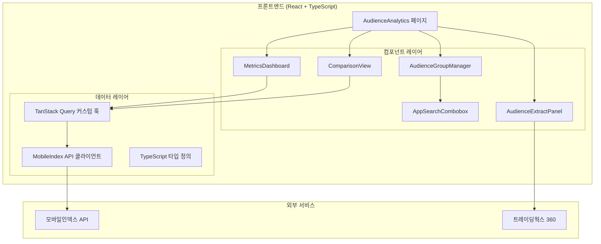
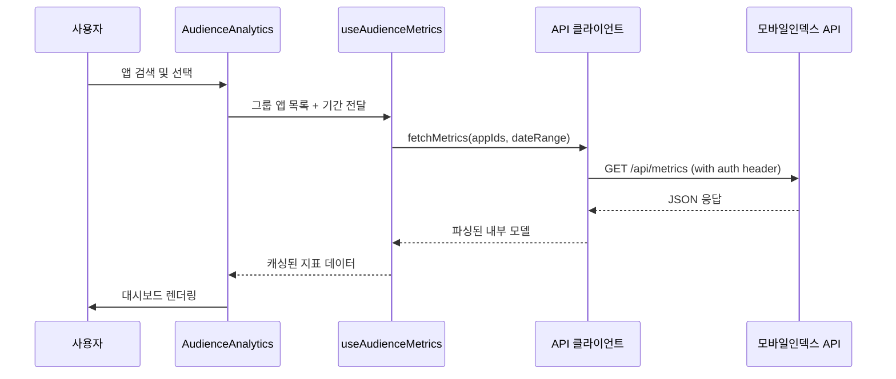
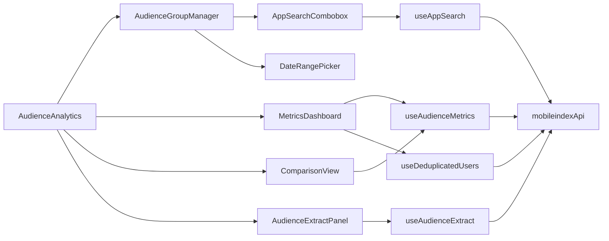

# 기술 설계 문서: 모바일인덱스 오디언스 분석

## 개요

모바일인덱스 API를 연동하여 오디언스 비교/분석 기능을 IGAWorks 웹사이트에 추가하는 기능의 기술 설계 문서입니다. 사용자는 최대 5개의 앱으로 오디언스 그룹을 구성하고, 최대 2개 그룹 간 주요 지표(MAU, 신규 설치자 수, 충성 고객 지표, 고착도, 교차 사용 지표, 신규 설치자 재방문율)를 비교·분석할 수 있습니다. 분석 결과는 트레이딩웍스 360에서 광고 캠페인에 활용할 수 있도록 오디언스 추출 기능을 제공합니다.

기존 프로젝트 스택(React + TypeScript + Vite, TanStack Query, shadcn/ui, Tailwind CSS, React Router)을 그대로 활용하며, 기존 레이아웃(Navbar, Footer)과 일관된 UI/UX를 유지합니다.

## 아키텍처

### 전체 구조



### 데이터 흐름



### 설계 원칙

- **기존 패턴 준수**: `wix-blog.ts`와 동일한 패턴으로 API 클라이언트 구현 (환경 변수, fetch 기반)
- **TanStack Query 활용**: 캐싱, 재시도, 백그라운드 갱신을 TanStack Query에 위임
- **컴포넌트 분리**: 페이지 → 기능 컴포넌트 → UI 컴포넌트 3단계 구조
- **타입 안전성**: 모든 API 응답과 내부 모델에 TypeScript 타입 정의

## 컴포넌트 및 인터페이스

### 페이지 컴포넌트

#### `AudienceAnalytics` (src/pages/AudienceAnalytics.tsx)
- 라우트: `/audience-analytics`
- 기존 Navbar, Footer 레이아웃 사용
- 상태: 오디언스 그룹 배열, 조회 기간, 비교 모드
- 하위 컴포넌트 조합 및 전체 레이아웃 관리

### 기능 컴포넌트

#### `AudienceGroupManager` (src/components/audience/AudienceGroupManager.tsx)
- 최대 2개 그룹 생성/삭제 관리
- 각 그룹의 이름 편집 기능
- 그룹 추가 버튼 (2개 도달 시 비활성화)

#### `AppSearchCombobox` (src/components/audience/AppSearchCombobox.tsx)
- shadcn/ui `Command` 컴포넌트 기반 검색 UI
- 디바운스된 검색어로 모바일인덱스 API 호출
- 앱 아이콘, 이름, 플랫폼(AOS/iOS) 표시
- 선택된 앱 목록 (최대 5개, 도달 시 비활성화)
- 앱 제거 버튼

#### `MetricsDashboard` (src/components/audience/MetricsDashboard.tsx)
- 6개 지표 카드 렌더링: MAU, 신규 설치자 수, 충성 고객 지표, 고착도, 교차 사용률/수, 신규 설치자 재방문율
- recharts 기반 라인/바 차트 시각화
- 중복 제거 전/후 사용자 수 표시
- 로딩/에러 상태 처리

#### `ComparisonView` (src/components/audience/ComparisonView.tsx)
- 2개 그룹 또는 그룹-앱 간 나란히 비교 뷰
- 차이값 및 변화율(%) 표시
- 오버레이 차트 (동일 차트에 두 데이터셋)

#### `AudienceExtractPanel` (src/components/audience/AudienceExtractPanel.tsx)
- 오디언스 추출 버튼 및 진행 상태
- 예상 도달 규모 표시
- 트레이딩웍스 360 연결 링크
- 에러 처리 UI

#### `DateRangePicker` (src/components/audience/DateRangePicker.tsx)
- 조회 기간 선택 UI
- 기존 shadcn/ui Calendar + Popover 활용

### 데이터 레이어

#### `mobileindex-api.ts` (src/lib/mobileindex-api.ts)
- 모바일인덱스 API 클라이언트
- 환경 변수에서 API 키 로드 (`VITE_MOBILEINDEX_API_KEY`)
- fetch 기반 HTTP 요청
- 응답 파싱 및 내부 모델 변환
- 지수 백오프 재시도 로직 (최대 3회)

#### TanStack Query 커스텀 훅 (src/hooks/use-audience-analytics.ts)
- `useAppSearch(query)`: 앱 검색 결과 조회
- `useAudienceMetrics(groupApps, dateRange)`: 그룹 지표 데이터 조회
- `useDeduplicatedUsers(groupApps)`: 중복 제거 사용자 데이터 조회
- `useAudienceExtract(groupApps)`: 오디언스 추출 뮤테이션
- 캐시 설정: staleTime 5분, 백그라운드 갱신

### 인터페이스 관계



## 데이터 모델

### API 응답 타입 (src/types/mobileindex.ts)

```typescript
/** 모바일인덱스 앱 검색 API 응답 */
export interface MobileIndexAppSearchResponse {
  status: number;
  message: string;
  data: MobileIndexAppItem[];
}

export interface MobileIndexAppItem {
  app_id: string;
  app_name: string;
  package_name: string;
  icon_url: string;
  platform: "AOS" | "iOS";
  category: string;
}

/** 모바일인덱스 지표 API 응답 */
export interface MobileIndexMetricsResponse {
  status: number;
  message: string;
  data: {
    mau: number;
    new_installs: number;
    loyal_users: number;
    stickiness: number;       // DAU/MAU × 100
    cross_usage_rate: number;
    cross_usage_count: number;
    revisit_rate: number;
    timeline: MobileIndexTimelineEntry[];
  };
}

export interface MobileIndexTimelineEntry {
  date: string;              // "YYYY-MM-DD"
  mau: number;
  new_installs: number;
  loyal_users: number;
  stickiness: number;
  cross_usage_rate: number;
  cross_usage_count: number;
  revisit_rate: number;
}

/** 중복 제거 API 응답 */
export interface MobileIndexDeduplicationResponse {
  status: number;
  message: string;
  data: {
    total_users: number;          // 합산 사용자 수
    deduplicated_users: number;   // 중복 제거 후 순 사용자 수
    overlap_count: number;        // 중복 사용자 수
  };
}

/** 오디언스 추출 API 응답 */
export interface MobileIndexAudienceExtractResponse {
  status: number;
  message: string;
  data: {
    segment_id: string;
    estimated_reach: number;      // 예상 도달 규모
    tradingworks_url: string;     // TW360 연결 URL
  };
}
```

### 내부 데이터 모델 (src/types/audience.ts)

```typescript
/** 앱 정보 (내부 모델) */
export interface AppInfo {
  id: string;
  name: string;
  packageName: string;
  iconUrl: string;
  platform: "AOS" | "iOS";
  category: string;
}

/** 오디언스 그룹 */
export interface AudienceGroup {
  id: string;
  name: string;
  apps: AppInfo[];
}

/** 조회 기간 */
export interface DateRange {
  startDate: string;   // "YYYY-MM-DD"
  endDate: string;     // "YYYY-MM-DD"
}

/** 지표 데이터 (내부 모델) */
export interface AudienceMetrics {
  mau: number;
  newInstalls: number;
  loyalUsers: number;
  stickiness: number;
  crossUsageRate: number;
  crossUsageCount: number;
  revisitRate: number;
  timeline: TimelineEntry[];
}

export interface TimelineEntry {
  date: string;
  mau: number;
  newInstalls: number;
  loyalUsers: number;
  stickiness: number;
  crossUsageRate: number;
  crossUsageCount: number;
  revisitRate: number;
}

/** 중복 제거 데이터 */
export interface DeduplicationData {
  totalUsers: number;
  deduplicatedUsers: number;
  overlapCount: number;
}

/** 비교 결과 */
export interface ComparisonResult {
  metricName: string;
  groupAValue: number;
  groupBValue: number;
  difference: number;
  changeRate: number;   // 변화율 (%)
}

/** 오디언스 추출 결과 */
export interface AudienceExtractResult {
  segmentId: string;
  estimatedReach: number;
  tradingworksUrl: string;
}
```

### API ↔ 내부 모델 변환 함수

```typescript
// src/lib/mobileindex-api.ts 내부

/** API 응답 → 내부 모델 변환 */
export function toAppInfo(item: MobileIndexAppItem): AppInfo {
  return {
    id: item.app_id,
    name: item.app_name,
    packageName: item.package_name,
    iconUrl: item.icon_url,
    platform: item.platform,
    category: item.category,
  };
}

/** 내부 모델 → API 요청 형식 변환 */
export function toApiAppItem(app: AppInfo): MobileIndexAppItem {
  return {
    app_id: app.id,
    app_name: app.name,
    package_name: app.packageName,
    icon_url: app.iconUrl,
    platform: app.platform,
    category: app.category,
  };
}

export function toAudienceMetrics(data: MobileIndexMetricsResponse["data"]): AudienceMetrics {
  return {
    mau: data.mau,
    newInstalls: data.new_installs,
    loyalUsers: data.loyal_users,
    stickiness: data.stickiness,
    crossUsageRate: data.cross_usage_rate,
    crossUsageCount: data.cross_usage_count,
    revisitRate: data.revisit_rate,
    timeline: data.timeline.map(toTimelineEntry),
  };
}

export function toTimelineEntry(entry: MobileIndexTimelineEntry): TimelineEntry {
  return {
    date: entry.date,
    mau: entry.mau,
    newInstalls: entry.new_installs,
    loyalUsers: entry.loyal_users,
    stickiness: entry.stickiness,
    crossUsageRate: entry.cross_usage_rate,
    crossUsageCount: entry.cross_usage_count,
    revisitRate: entry.revisit_rate,
  };
}
```

### 상태 관리 구조

페이지 레벨 상태는 `useState`로 관리하며, 서버 데이터는 TanStack Query로 관리합니다.

```typescript
// AudienceAnalytics 페이지 상태
interface PageState {
  groups: AudienceGroup[];        // 최대 2개
  dateRange: DateRange;
  comparisonMode: "group-vs-group" | "group-vs-app" | null;
}
```


## 정확성 속성 (Correctness Properties)

*속성(Property)은 시스템의 모든 유효한 실행에서 참이어야 하는 특성 또는 동작입니다. 속성은 사람이 읽을 수 있는 명세와 기계가 검증할 수 있는 정확성 보장 사이의 다리 역할을 합니다.*

### Property 1: 앱 추가 시 그룹 크기 증가

*For any* 오디언스 그룹(앱 수 < 5)과 유효한 앱에 대해, 해당 앱을 그룹에 추가하면 그룹의 앱 수가 정확히 1 증가하고, 추가된 앱이 그룹에 포함되어야 한다.

**Validates: Requirements 1.2**

### Property 2: 그룹 내 최대 앱 수 불변식

*For any* 오디언스 그룹에 대해, 앱 추가 연산을 수행한 후 그룹의 앱 수는 절대 5를 초과할 수 없다. 이미 5개인 그룹에 앱 추가를 시도하면 그룹은 변경되지 않아야 한다.

**Validates: Requirements 1.3**

### Property 3: 앱 제거 시 그룹 크기 감소

*For any* 오디언스 그룹과 그룹 내 존재하는 앱에 대해, 해당 앱을 제거하면 그룹의 앱 수가 정확히 1 감소하고, 제거된 앱이 그룹에 더 이상 포함되지 않아야 한다.

**Validates: Requirements 1.4**

### Property 4: 최대 그룹 수 불변식

*For any* 그룹 생성/삭제 연산 시퀀스에 대해, 오디언스 그룹의 수는 절대 2를 초과할 수 없다. 이미 2개인 상태에서 그룹 추가를 시도하면 그룹 목록은 변경되지 않아야 한다.

**Validates: Requirements 2.1, 2.2, 2.3**

### Property 5: 그룹 삭제 시 완전 제거

*For any* 오디언스 그룹 목록과 삭제 대상 그룹에 대해, 그룹을 삭제하면 그룹 수가 정확히 1 감소하고, 삭제된 그룹의 ID와 포함된 앱이 더 이상 존재하지 않아야 한다.

**Validates: Requirements 2.4**

### Property 6: API 응답 변환 라운드트립

*For any* 유효한 모바일인덱스 API 앱 응답 객체에 대해, `toAppInfo`로 내부 모델로 변환한 뒤 `toApiAppItem`으로 다시 API 형식으로 직렬화하면 원본 객체와 동등한 결과를 생성해야 한다.

**Validates: Requirements 6.3, 6.4**

### Property 7: 지표 데이터 변환 라운드트립

*For any* 유효한 모바일인덱스 타임라인 엔트리에 대해, `toTimelineEntry`로 내부 모델로 변환한 뒤 다시 API 형식으로 직렬화하면 원본 엔트리와 동등한 결과를 생성해야 한다.

**Validates: Requirements 6.3, 6.4**

### Property 8: 재시도 후 실패 시 에러 정보 포함

*For any* 네트워크 오류로 실패하는 API 요청에 대해, 최대 3회 재시도 후에도 실패하면 반환되는 에러 객체에 HTTP 상태 코드, 에러 메시지, 요청 URL 정보가 포함되어야 한다.

**Validates: Requirements 6.5, 6.6**

### Property 9: 비교 지표 차이값 및 변화율 계산 정확성

*For any* 두 개의 유효한 지표 값(groupA, groupB)에 대해, 차이값은 `groupB - groupA`이고, 변화율은 `groupA > 0`일 때 `((groupB - groupA) / groupA) × 100`이어야 한다. `groupA === 0`일 때는 변화율이 적절히 처리되어야 한다.

**Validates: Requirements 5.3**

### Property 10: 조회 기간 변경 시 쿼리 키 갱신

*For any* 앱 조합과 두 개의 서로 다른 조회 기간에 대해, 기간이 변경되면 TanStack Query의 쿼리 키가 달라져야 하며, 이는 새로운 데이터 요청을 트리거해야 한다.

**Validates: Requirements 4.4, 9.2**

## 에러 처리

### API 에러 처리 전략

| 에러 유형 | 처리 방식 | 사용자 메시지 |
|-----------|-----------|---------------|
| 네트워크 오류 | 지수 백오프 재시도 (최대 3회) | "데이터를 불러올 수 없습니다. 다시 시도해 주세요." + 재시도 버튼 |
| 인증 오류 (401) | 재시도 없이 즉시 에러 반환 | "인증에 실패했습니다. 관리자에게 문의해 주세요." |
| 서버 오류 (5xx) | 지수 백오프 재시도 (최대 3회) | "서버 오류가 발생했습니다. 잠시 후 다시 시도해 주세요." |
| 중복 제거 실패 | 재시도 없이 에러 표시 | "중복 제거 데이터를 불러올 수 없습니다" |
| 오디언스 추출 실패 | 재시도 없이 에러 표시 | "오디언스 추출에 실패했습니다. 다시 시도해 주세요." |
| 잘못된 응답 형식 | 파싱 에러로 처리 | "데이터 형식 오류가 발생했습니다." |

### 지수 백오프 재시도 로직

```typescript
async function fetchWithRetry<T>(
  url: string,
  options: RequestInit,
  maxRetries = 3
): Promise<T> {
  let lastError: Error;
  for (let attempt = 0; attempt <= maxRetries; attempt++) {
    try {
      const response = await fetch(url, options);
      if (!response.ok) {
        if (response.status === 401) {
          throw new ApiError("인증 실패", response.status, url);
        }
        throw new ApiError(
          `API 오류: ${response.status}`,
          response.status,
          url
        );
      }
      return await response.json();
    } catch (error) {
      lastError = error instanceof Error ? error : new Error(String(error));
      if (attempt < maxRetries) {
        const delay = Math.pow(2, attempt) * 1000; // 1s, 2s, 4s
        await new Promise((resolve) => setTimeout(resolve, delay));
      }
    }
  }
  throw lastError!;
}
```

### 에러 타입 정의

```typescript
export class ApiError extends Error {
  constructor(
    message: string,
    public statusCode: number,
    public requestUrl: string
  ) {
    super(message);
    this.name = "ApiError";
  }
}
```

### 컴포넌트 레벨 에러 처리

- TanStack Query의 `isError`, `error` 상태를 활용하여 각 컴포넌트에서 에러 UI 렌더링
- 재시도 버튼은 TanStack Query의 `refetch` 함수 호출
- 에러 발생 시 sonner 토스트로 사용자에게 알림

## 테스팅 전략

### 테스트 프레임워크

- **단위 테스트**: Vitest (이미 프로젝트에 설정됨)
- **속성 기반 테스트**: fast-check (Vitest와 통합)
- **컴포넌트 테스트**: @testing-library/react (이미 설정됨)

### 속성 기반 테스트 (Property-Based Testing)

fast-check 라이브러리를 사용하여 각 정확성 속성을 검증합니다. 각 테스트는 최소 100회 반복 실행됩니다.

각 속성 테스트는 다음 태그 형식의 주석을 포함해야 합니다:
**Feature: mobileindex-audience-analytics, Property {number}: {property_text}**

#### 속성 테스트 대상

| 속성 | 테스트 파일 | 설명 |
|------|------------|------|
| Property 1 | `src/test/audience-group.property.test.ts` | 앱 추가 시 그룹 크기 증가 |
| Property 2 | `src/test/audience-group.property.test.ts` | 최대 앱 수 불변식 |
| Property 3 | `src/test/audience-group.property.test.ts` | 앱 제거 시 그룹 크기 감소 |
| Property 4 | `src/test/audience-group.property.test.ts` | 최대 그룹 수 불변식 |
| Property 5 | `src/test/audience-group.property.test.ts` | 그룹 삭제 시 완전 제거 |
| Property 6 | `src/test/mobileindex-api.property.test.ts` | API 앱 응답 변환 라운드트립 |
| Property 7 | `src/test/mobileindex-api.property.test.ts` | 타임라인 엔트리 변환 라운드트립 |
| Property 8 | `src/test/mobileindex-api.property.test.ts` | 재시도 후 에러 정보 포함 |
| Property 9 | `src/test/comparison.property.test.ts` | 비교 지표 계산 정확성 |
| Property 10 | `src/test/query-keys.property.test.ts` | 쿼리 키 갱신 |

### 단위 테스트

단위 테스트는 속성 테스트가 커버하지 않는 구체적인 예시, 엣지 케이스, 에러 조건에 집중합니다.

| 테스트 대상 | 테스트 파일 | 주요 케이스 |
|------------|------------|------------|
| API 클라이언트 인증 | `src/test/mobileindex-api.test.ts` | 환경 변수에서 API 키 로드, 헤더 포함 확인 |
| 중복 제거 API 호출 조건 | `src/test/mobileindex-api.test.ts` | 2개 이상 앱 시 호출, 1개 앱 시 미호출 |
| 에러 메시지 표시 | `src/test/error-handling.test.ts` | 중복 제거 실패, 오디언스 추출 실패, API 실패 시 메시지 |
| 라우팅 | `src/test/routing.test.ts` | `/audience-analytics` 경로 접근 |
| 로딩 상태 | `src/test/loading.test.ts` | 로딩 스피너 표시 |
| 캐시 설정 | `src/test/cache-config.test.ts` | staleTime 5분 설정 확인 |

### 테스트 실행

```bash
# 전체 테스트 실행
npm run test

# 속성 테스트만 실행
npx vitest run --reporter=verbose src/test/*.property.test.ts
```
